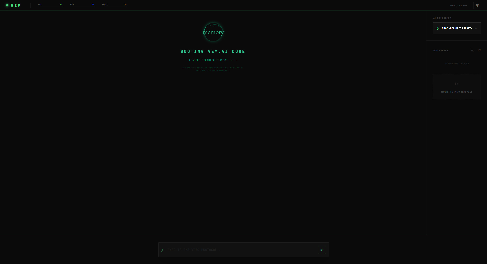
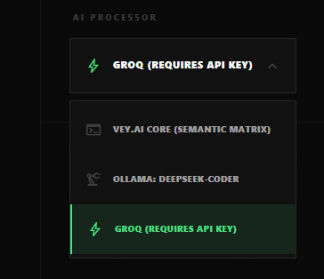

# VEY.AI — Персональная Операционная Система Знаний

VEY.AI — это десктопное приложение, которое превращает ваши локальные файлы, книги и код в единую интеллектуальную базу знаний. Вы загружаете папку с проектом или библиотекой текстов, а встроенная нейросеть анализирует их и отвечает на ваши вопросы, опираясь строго на ваши данные.

Приложение работает полностью локально. Ни одна строка вашего кода или текста не отправляется в интернет (если вы сами не подключите облачную модель через настройки).

---

## Как это выглядит

Ниже представлены скриншоты работающего приложения.

### Загрузка системы



При первом запуске приложение показывает анимированный экран загрузки, пока нейросетевые модели инициализируются в оперативной памяти. Обычно это занимает 10-30 секунд.

### Панель настроек



В настройках можно переключаться между тремя движками ИИ: локальной моделью, сервером Ollama и облаком Groq. Также доступна смена визуальной темы оформления.

---

## Что умеет VEY.AI

### Поиск по вашим файлам и книгам

Вы можете загрузить в приложение любую папку: проект на Python, JavaScript, Rust, или коллекцию книг в формате PDF, Word, Markdown, TXT. Система прочитает все файлы, разобьет их на смысловые фрагменты и превратит каждый кусок в математический вектор (набор чисел, описывающих смысл текста).

Когда вы задаете вопрос в чате, система берет ваш вопрос, тоже превращает его в вектор, и ищет среди всех сохраненных фрагментов те, которые ближе всего по смыслу. Найденные фрагменты передаются нейросети, и она формирует ответ, опираясь именно на ваши данные.

Такой подход называется RAG (Retrieval-Augmented Generation) — генерация с подкреплением поиском. Благодаря этому нейросеть не выдумывает факты, а цитирует ваши документы.

### Работа с книгами и документами

Система поддерживает широкий спектр форматов файлов:
- Текстовые файлы: `.txt`, `.md` (Markdown)
- Документы: `.pdf`, `.docx` (Microsoft Word), `.odt` (LibreOffice)
- Исходный код: `.py`, `.js`, `.jsx`, `.rs`, `.html`, `.css`, `.json`, `.toml`
- Изображения с текстом: `.png`, `.jpg` (через распознавание символов, если установлен Tesseract OCR)

Вы можете, например, скачать PDF книгу по продуктивности, положить ее в папку, открыть эту папку в VEY.AI и спрашивать: "Какие основные принципы тайм-менеджмента описаны в моей книге?". Нейросеть найдет нужные страницы и ответит своими словами.

### Анализ кода

Если вы откроете папку с программным проектом, нейросеть сможет:
- Найти и объяснить, что делает конкретная функция
- Предложить исправления или рефакторинг
- Написать тесты или документацию для вашего кода
- Предложить изменения в файлах (с обязательным подтверждением от вас)

### Встроенный терминал

Набрав в строке чата команду с восклицательным знаком (например, `!npm -v` или `!python --version`), вы можете исполнять системные команды прямо внутри диалога. Вывод терминала отрисовывается как красивое сообщение с возможностью продолжать сессию.

### Три движка ИИ на выбор

В настройках доступны три варианта нейросети:
1. **Локальная модель (VEY.AI Core)** — Qwen 2.5 Coder на 1.5 миллиарда параметров. Работает прямо на вашем компьютере, не требует интернета. Подходит для машин с 8+ ГБ оперативной памяти.
2. **Ollama** — если у вас уже установлен Ollama с другими моделями (например, DeepSeek Coder, Llama 3), VEY.AI подключится к нему автоматически и покажет список доступных моделей.
3. **Groq Cloud** — облачная генерация с задержкой менее секунды. Требует бесплатный API-ключ с сайта Groq. Идеально подходит для слабых машин без видеокарты.

### Мониторинг системы

В верхней панели приложения в реальном времени отображаются три индикатора:
- **CPU** — текущая загрузка процессора
- **RAM** — использование оперативной памяти
- **INDEX** — статус индексации файлов

Данные обновляются каждую секунду, бэкенд собирает их с помощью системной библиотеки psutil.

### Сохранение рабочего пространства

При выборе папки VEY.AI запоминает ее путь в локальном хранилище браузера. При следующем запуске приложение автоматически восстановит последний открытый проект и переиндексирует его файлы. Вам не нужно каждый раз заново монтировать папку.

---

## Структура проекта

Проект разделен на две ключевые части: бэкенд (серверная часть с нейросетью) и фронтенд (интерфейс пользователя).

### Серверная часть (Backend)

Находится в файле `scripts/ai_service.py`. Это единый Python-скрипт, в котором сосредоточена вся логика:
- Загрузка и инференс (работа) нейросетевых моделей
- Векторизация и поиск по файлам (RAG)
- Обработка запросов из интерфейса
- Исполнение терминальных команд
- Сбор метрик системы (CPU, RAM)

Используемые технологии:
- **FastAPI** — веб-фреймворк для обработки HTTP запросов
- **Sentence-Transformers (all-MiniLM-L6-v2)** — модель для превращения текста в векторы, используемая для поиска
- **Qwen/Qwen2.5-Coder-1.5B-Instruct** — основная языковая модель для генерации ответов
- **PyTorch** — фреймворк машинного обучения, на котором работают обе модели
- **Uvicorn** — ASGI сервер, обрабатывающий соединения

### Клиентская часть (Frontend)

Находится в директории `vey-v2/`. Это React-приложение, завернутое в десктопную оболочку Tauri.
- **React 18** — библиотека для построения пользовательского интерфейса
- **Vite** — сборщик, обеспечивающий мгновенную перезагрузку при разработке
- **Tailwind CSS** — утилитарный фреймворк для стилизации
- **Tauri 2.0** — Rust-фреймворк для создания легковесных десктопных приложений (вместо тяжелого Electron)
- **React-Markdown + KaTeX** — рендеринг Markdown и математических формул в ответах ИИ

### Дерево файлов

```
vey-main/
|-- scripts/
|   |-- ai_service.py          # Весь бэкенд: ИИ, RAG, API
|-- vey-v2/
|   |-- src/
|   |   |-- App.jsx             # Главный компонент интерфейса
|   |   |-- assets/             # Статические ресурсы (логотипы, иконки)
|   |-- src-tauri/
|   |   |-- src/
|   |   |   |-- lib.rs          # Rust-логика десктопного приложения
|   |   |-- tauri.conf.json     # Конфигурация Tauri
|   |   |-- icons/              # Иконки приложения для всех платформ
|   |-- package.json            # Зависимости фронтенда
|-- books/                      # Пример директории для книг и документов
|-- README.md                   # Этот файл
```

---

## Как запустить проект

### Системные требования

- Операционная система: Windows 10/11, macOS 12+ или Linux
- Оперативная память: минимум 8 ГБ, рекомендуется 16 ГБ
- Видеокарта NVIDIA (опционально) — ускоряет работу нейросети. Без нее модель будет работать на процессоре, просто чуть медленнее
- Установленный Python 3.10 или 3.11 (добавленный в PATH)
- Установленный Node.js (рекомендуется версия 20 LTS)
- Установленный Rust и Cargo (необходим для сборки Tauri)

### Пошаговая установка

1. Склонируйте репозиторий:
```
git clone https://github.com/<ваш-аккаунт>/vey-main.git
```

2. Установите Python-зависимости для бэкенда:
```
pip install fastapi pydantic torch transformers sentence-transformers uvicorn psutil requests pypdf
```

3. Перейдите в директорию фронтенда и установите JavaScript-зависимости:
```
cd vey-v2
npm install
```

4. Запустите приложение в режиме разработки:
```
npm run tauri dev
```

При первом запуске система автоматически скачает весовые файлы нейросетей (около 3 ГБ). Это может занять несколько минут в зависимости от скорости интернета. Дождитесь, пока экран загрузки сменится на интерфейс чата.

### Сборка готового приложения (EXE)

Для компиляции автономного исполняемого файла:
```
npm run tauri build
```
Готовый бинарник появится в папке `vey-v2/src-tauri/target/release/`.

---

## Как протестировать основные функции

### Тест 1. Загрузка книг и поиск по ним

1. Создайте на рабочем столе папку, внутри положите пару текстовых или PDF файлов с любым содержимым.
2. В приложении нажмите кнопку "Mount Local Workspace" в правой панели.
3. Выберите эту папку.
4. Дождитесь, пока файлы отобразятся в дереве справа.
5. Задайте вопрос в чате, который относится к содержимому загруженных файлов.
6. Убедитесь, что нейросеть нашла информацию и ответила на основе ваших документов.

### Тест 2. Анализ кода

1. Загрузите папку с любым программным проектом (например, папку со скриптами на Python).
2. Попросите ИИ: "Объясни, что делает главный файл проекта".
3. Проверьте, что ответ содержит корректную информацию о структуре и функциях кода.

### Тест 3. Встроенный терминал

1. Введите в чат команду с восклицательным знаком, например: `!dir` (Windows) или `!ls` (Linux/macOS).
2. Убедитесь, что результат отобразился в интерактивном окне терминала внутри диалога.
3. Попробуйте ввести следующую команду прямо в этом окне терминала.

### Тест 4. Переключение модели ИИ

1. Нажмите на иконку настроек (шестеренка) в правом верхнем углу.
2. Если у вас есть ключ Groq, вставьте его в поле API Key. Система подтянет список доступных моделей.
3. Выберите модель и задайте вопрос — ответ придет уже от облачной нейросети.

### Тест 5. Модификация файлов через ИИ

1. Загрузите рабочее пространство с текстовыми файлами.
2. Попросите ИИ изменить или создать файл.
3. Убедитесь, что появилась карточка подтверждения с кнопками "Authorize Modification" и "Deny Access".
4. Нажмите "Authorize" и проверьте, что файл изменился.

---

## Используемые технологии

| Компонент | Технология | Назначение |
|---|---|---|
| Интерфейс | React 18, Vite | Реактивный UI с мгновенной перезагрузкой |
| Стилизация | Tailwind CSS | Темная тема с неоновыми акцентами |
| Десктоп | Tauri 2.0 (Rust) | Легковесная оболочка вместо Electron |
| Сервер | FastAPI, Uvicorn | Быстрый API для связки фронтенда и ИИ |
| Поиск (RAG) | Sentence-Transformers | Семантический поиск по файлам и книгам |
| ИИ-модель | Qwen 2.5 Coder 1.5B | Локальная генерация текста и анализ кода |
| ML-фреймворк | PyTorch | Вычисления на GPU или CPU |
| Markdown | react-markdown, KaTeX | Красивая отрисовка ответов нейросети |

---

## Ключевые архитектурные решения

**Почему Tauri, а не Electron?**
Electron запускает полноценный браузер Chromium для каждого окна, что требует сотни мегабайт оперативной памяти. Tauri использует встроенный системный WebView (WebView2 на Windows), благодаря чему итоговый файл приложения весит менее 10 МБ и потребляет в разы меньше ресурсов. Это критически важно, потому что параллельно на машине работает тяжелая нейросеть.

**Почему RAG, а не просто отправка всех файлов в нейросеть?**
У любой нейросети есть ограничение на объем входного текста (контекстное окно). Если попытаться скормить ей все файлы проекта целиком, она либо зависнет, либо начнет выдавать бессмысленные ответы. RAG решает эту проблему: система заранее индексирует все файлы, а при вопросе передает нейросети только 4 самых релевантных фрагмента. Результат — быстрый и точный ответ даже для проектов с тысячами файлов.

**Почему Qwen 2.5 Coder?**
В категории компактных моделей (до 3 миллиардов параметров) Qwen 2.5 Coder показывает лучшие результаты в понимании и генерации кода. Модель весит около 3 ГБ и способна работать даже на обычных ноутбуках без видеокарты.

---

## Лицензия и Авторство

Проект разработан с фокусом на продуктивность и технологическую доступность.
VEY.AI не просто читает код — он помогает его осмыслить.
VEY.AI не просто хранит книги — он делает их живыми.
